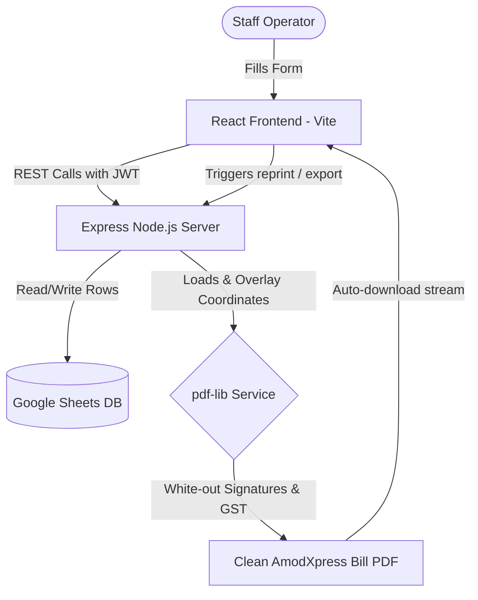

# System Architecture & Scaling Guide

This document explains the software architecture, design patterns, and future scaling plans for the AmodXpress Courier Billing & Consignment Management System.

---

## 1. Directory Tree & Explanations

Here is a map of the file layout:

```text
amodxpress/
├── backend/
│   ├── src/
│   │   ├── config/          # Configurations for security, JWT options
│   │   ├── controllers/     # Route handlers coordinating sheets/PDF actions
│   │   ├── middleware/      # Authentication verification, Rate limiter, Error catcher
│   │   ├── routes/          # Express route bindings
│   │   ├── services/        # Google Sheets synchronizer, PDF coordinate filler
│   │   ├── utils/           # Numbers to words converter, Zod schemas
│   │   └── server.ts        # Boot entrypoint
│   ├── templates/           # PDF templates (courier_bill_template.pdf)
│   ├── scripts/             # Initial templates generation scripts
│   ├── package.json
│   ├── tsconfig.json
│   └── .env.example
├── frontend/
│   ├── src/
│   │   ├── components/      # UI wrappers (Layout shell, Loading spinners)
│   │   ├── contexts/        # Auth state provider and token checks
│   │   ├── pages/           # Pages (Dashboard, Create, Search, Reports)
│   │   ├── services/        # Axios API client
│   │   ├── utils/           # Math computations, client validations
│   │   ├── App.tsx          # Private router config
│   │   ├── index.css        # Tailwind classes
│   │   └── main.tsx         # React mount node
│   ├── package.json
│   └── tailwind.config.js
└── package.json             # Root monorepo manager
```

---

## 2. Core Architectural Flow



1. **State & Cache Management**: The frontend utilizes `@tanstack/react-query` to fetch, cache, and automatically invalidate queries after bookings are deleted, updated, or created.
2. **Double Validation (Zod)**: Inputs are validated on the client inside React Hook Form for immediate feedback (e.g. 10-digit mobile, 6-digit pin) and re-validated on the server.
3. **Template Manipulation**: Instead of compiling a new PDF canvas, `pdf-lib` reads the existing PDF structure. It draws white rectangles to overwrite the GST grid and signature areas, keeping the original layout unmodified.

---

## 3. Future Scalability Blueprint

Our modular folder structure is designed to support the following enhancements:

- **Database Migration**: Swap `google-sheets.service.ts` with a Prisma/Sequelize adapter pointing to PostgreSQL or MySQL.
- **Roles & Multi-branch Permissions**: Extend the JWT payloads inside `auth.middleware.ts` to include `branchId` and `role` (Operator, Branch Manager, Admin) to filter dashboard metrics per branch.
- **Hardware Integration**:
  - **Thermal Printers (58mm/80mm)**: Create a secondary CSS layout inside `frontend/src/pages/SearchBills.tsx` using `@media print` with custom width parameters to print labels directly.
  - **Barcode Scanner**: Add an keypress listener in `CreateBillForm.tsx` to automatically populate the `consignmentNumber` by parsing hardware scan inputs.
- **Integrations**:
  - **WhatsApp / SMS API**: Integrate twilio or clicksend hooks in `bill.controller.ts` to send a message template to the sender/receiver immediately after saving the consignment.
  - **Email Attachments**: Add nodemailer to mail the generated PDF stream directly.
